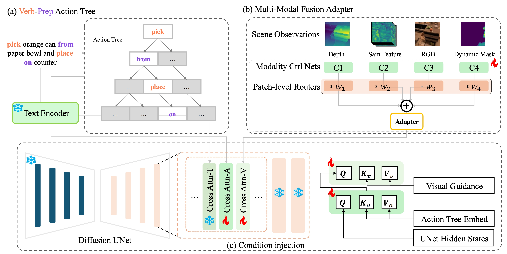

# ManipDreamer

## Overview

While recent advancements in robotic manipulation video synthesis have shown promise, significant challenges persist in ensuring effective instruction-following and achieving high visual quality.
Recent methods, like RoboDreamer, utilize linguistic decomposition to divide instructions into separate lower-level primitives. 
They condition the world model on these primitives to achieve compositional instruction-following. 
However, these separate primitives do not take into account the relationships that exist between them. 
Furthermore, recent methods neglect valuable visual guidance, including depth and semantic guidance, both crucial for enhancing visual quality.
This paper introduces ManipDreamer, an advanced world model based on the action tree and visual guidance. 
To better learn the relationships between instruction primitives, we represent the instruction as the action tree and assign embeddings to tree nodes. 
Therefore, each instruction can acquire its embeddings by navigating through the action tree. 
The instruction embeddings can be used to guide the world model. 
To enhance visual quality, we combine depth and semantic guidance by introducing a visual guidance adapter compatible with the world model. 
This visual adapter enhances both the temporal and physical consistency of video generation.
Based on the action tree and visual guidance, ManipDreamer significantly boosts the instruction-following ability and visual quality.
Comprehensive evaluations on robotic manipulation benchmarks reveal that ManipDreamer achieves large improvements in video quality metrics in both seen and unseen tasks, 
with PSNR improved from 19.55 to 21.05, SSIM improved from 0.7474 to 0.7982 and reduced Flow Error from 3.506 to 3.201 in unseen tasks, compared to the recent RoboDreamer model.
Additionally, our method increases the success rate of robotic manipulation tasks by 2.5% in 6 RLbench tasks on average.